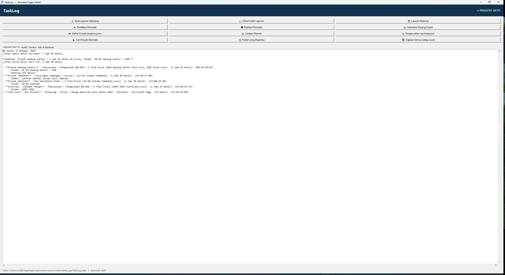

# TaskLog — Pencatat Tugas Harian Otomatis (Windows)

> Aplikasi kecil untuk Windows yang **mencatat sendiri** apa yang Anda kerjakan di laptop,
> lalu menyusunnya menjadi **laporan pekerjaan harian**: 1 item pekerjaan per proyek.
> Satu file `.exe`, tanpa instalasi, tanpa akun, tanpa internet.



---

## Masalah yang diselesaikan

Banyak pekerja (Quantity Surveyor, estimator, admin proyek, konsultan) diwajibkan mengisi
laporan kerja harian atau bulanan. Biasanya ditulis manual dari ingatan — sering lupa,
sering tidak akurat.

TaskLog mengerjakannya otomatis: begitu aplikasi jalan, ia diam-diam mencatat
- file Excel/Word/PDF apa yang dibuka, **dan di folder proyek mana**,
- aplikasi apa yang dipakai (Zoom, Teams, AutoCAD, browser, dll),
- judul meeting Zoom/Teams (topik rapat),
- folder yang ditelusuri di File Explorer,

lalu merangkumnya jadi kalimat siap tempel:

```
- Proyek Gedung Kantor : Penyusunan / Pengecekan BQ-RAB — 2 file Excel
  (RAB Gedung Kantor Rev2.xlsx, BOQ Final.xlsx)  (2 jam 35 menit)  (08:10–10:45)
    - folder: GK-01 Gedung Kantor \ RAB
```

---

## Cara pakai

### Untuk pengguna biasa (tanpa Python)

1. Unduh `TaskLog.exe` dari halaman [**Releases**](../../releases).
2. Taruh di folder mana saja, misalnya `D:\TaskLog\`. Dobel-klik.
3. Klik tombol **"Siapkan Semua (setup awal)"**. Selesai.

Aplikasi otomatis:
- mencari sendiri nama-nama proyek dari folder Anda (OneDrive / Desktop / Documents),
- membuat file pengaturan yang bisa Anda sunting,
- memasang dirinya supaya jalan otomatis setiap kali Windows dinyalakan,
- membuat shortcut di Desktop.

> **Windows SmartScreen** akan memberi peringatan saat pertama dibuka karena `.exe` ini
> tidak ditandatangani secara digital. Klik **More info → Run anyway**.
> Ini normal untuk aplikasi gratis tanpa sertifikat.

### Untuk yang mau menjalankan dari source

```bash
pip install -r requirements.txt
python app.py
```

Butuh **Python 3.8+** di Windows. Untuk menyiapkan config + autostart tanpa membuka GUI:

```bash
python app.py --setup
python app.py --status
python app.py --report           # tulis laporan hari ini, lalu keluar
python app.py --tracker          # jalankan pencatat di latar belakang
python app.py --autostart off    # copot autostart
```

### Membuat `.exe` sendiri

```bash
pip install pyinstaller
pyinstaller --onefile --noconsole --name TaskLog ^
  --hidden-import win32com --hidden-import win32com.client ^
  --hidden-import pythoncom --hidden-import pywintypes ^
  --collect-submodules win32com app.py
```

Atau pakai GitHub Actions: `.github/workflows/build.yml` sudah disiapkan. Buat tag
(`git tag v1.0.0 && git push --tags`) dan runner akan otomatis membangun `.exe`
serta menempelkannya ke Release.

---

## Fitur

| Fitur | Keterangan |
|---|---|
| **Pencatatan otomatis** | Polling jendela aktif setiap 10 detik, dijalankan sebagai proses latar belakang tanpa jendela. |
| **Deteksi proyek** | Dipetakan dari **lokasi folder file**, bukan dari judul jendela. Jadi file Excel di `\Proyek Medan\RAB\` dikenali sebagai "Proyek Medan". |
| **Dukungan OneDrive** | URL Excel online (`https://d.docs.live.net/...`) diterjemahkan otomatis ke path lokal. |
| **Meeting** | Judul Zoom/Teams dipakai sebagai topik rapat; proyek diwarisi dari aktivitas terakhir (maks 45 menit). |
| **Catatan manual** | Pekerjaan di luar laptop (kunjungan lapangan, telepon, rapat offline) bisa ditambahkan lewat `manual_entries.json`. |
| **Laporan harian** | 1 blok per proyek, menempelkan file Excel yang disentuh + durasi. Filter noise < 45 detik. |
| **Laporan bulanan** | Rekap otomatis semua hari dalam 1 bulan. |
| **Versi 1 baris** | `Ringkas_YYYY-MM-DD.txt` siap tempel ke Google Calendar / WhatsApp. |
| **Mode audit** | `--audit` menampilkan sumber tiap baris laporan, supaya Anda bisa memverifikasi tidak ada yang salah catat. |
| **Daftar pengecualian** | Aplikasi/jendela sensitif bisa diblokir **di level database** — tidak ditulis sama sekali, bukan cuma disembunyikan dari laporan. |
| **Sepenuhnya offline** | Tidak ada koneksi internet, tidak ada telemetri, tidak ada akun. Data hanya di laptop Anda. |

---

## Lokasi file

Data (bisa disunting) ada di folder `TaskLog_data\` **di sebelah** `TaskLog.exe`:

| File | Isi |
|---|---|
| `TaskLog_data\projects.json` | daftar proyek + kata kunci pencocokan |
| `TaskLog_data\exclude.json` | aplikasi/kata yang **tidak** dicatat |
| `TaskLog_data\manual_entries.json` | catatan pekerjaan di luar laptop |
| `TaskLog_data\Laporan\Laporan_Harian_*.md` | laporan harian |
| `TaskLog_data\Laporan\Ringkas_*.txt` | versi 1 baris untuk Google Calendar |
| `TaskLog_data\Laporan\Laporan_Bulanan_*.md` | rekap bulanan |
| `TaskLog_data\Laporan\Audit_*.txt` | jejak sumber tiap baris |
| `TaskLog_data\LOG\` | log aplikasi & pencatat |

Database mentah disimpan terpisah di `%LOCALAPPDATA%\TaskLog\activity.db` (lokal).

### Format `projects.json`

```json
{
  "_roots_scan": ["C:/Users/NamaAnda/OneDrive"],
  "projects": [
    { "name": "Proyek Medan",  "keys": ["medan", "proyek medan", "mdn-01"] },
    { "name": "Proyek Kediri", "keys": ["kediri", "variation order kediri"] }
  ]
}
```

Aturan: dicek urut dari atas, **pencocokan pertama menang**. Taruh proyek yang paling
spesifik di atas. `keys` dicocokkan terhadap jalur folder & nama file.

### Format `manual_entries.json`

```json
{
  "2026-10-06": [
    { "project": "Proyek Medan", "act": "Kunjungan Lapangan",
      "minutes": 120, "start": "09:00", "end": "11:00", "note": "Survey lokasi" }
  ]
}
```

### Format `exclude.json`

```json
{
  "procs": ["chrome.exe", "bitwarden.exe"],
  "words": ["m-banking", "bukalapak", "rekening"]
}
```

Jendela yang cocok dengan salah satu aturan **tidak ditulis ke database sama sekali**.

---

## Privasi

TaskLog hanya membaca **judul jendela** dan **lokasi file/folder** yang sedang aktif.
Ia tidak mengambil isi dokumen, tidak merekam layar, tidak mengetik apa pun, dan
tidak mengirim data ke mana pun. Semua file berada di komputer Anda.

Tetap disarankan memakai `exclude.json` untuk aplikasi pribadi: perbankan, dompet
digital, password manager, email pribadi, dan sejenisnya.

---

## Keterbatasan

- **Windows saja.** Bergantung pada Win32 API (`win32gui`, `win32com`, `psutil`).
- Deteksi murni dari **judul jendela**. Aplikasi yang menyembunyikan nama file
  (misalnya Excel dengan jendela nonaktif) tidak akan terbaca sedetail itu.
- Nama proyek harus mengandung kata kunci yang Anda daftarkan. Kalau folder proyek
  berganti nama, perbarui `projects.json`.
- Belum tersambung ke Google Calendar (rencananya menyusul lewat `Ringkas_*.txt`).

---

## English summary

**TaskLog** is a small Windows app that passively logs which files (especially Excel)
and applications you work with, maps them to projects by folder path, and writes a
daily work report with **one entry per project**. It ships as a single `.exe`
(no installation, no account, no internet), runs silently in the background, and can
block sensitive apps entirely via `exclude.json`. Built for Quantity Surveyors and
project administrators who must submit daily/monthly work logs. Indonesian UI.

Cross-platform ports and Google Calendar sync are welcome as pull requests.

---

## Lisensi

MIT — bebas dipakai, diubah, dan dibagikan. Lihat [LICENSE](LICENSE).

Dibuat untuk membantu pekerjaan administrasi proyek sehari-hari.
Kontribusi, laporan bug, dan ide fitur sangat diterima lewat
[Issues](../../issues).
